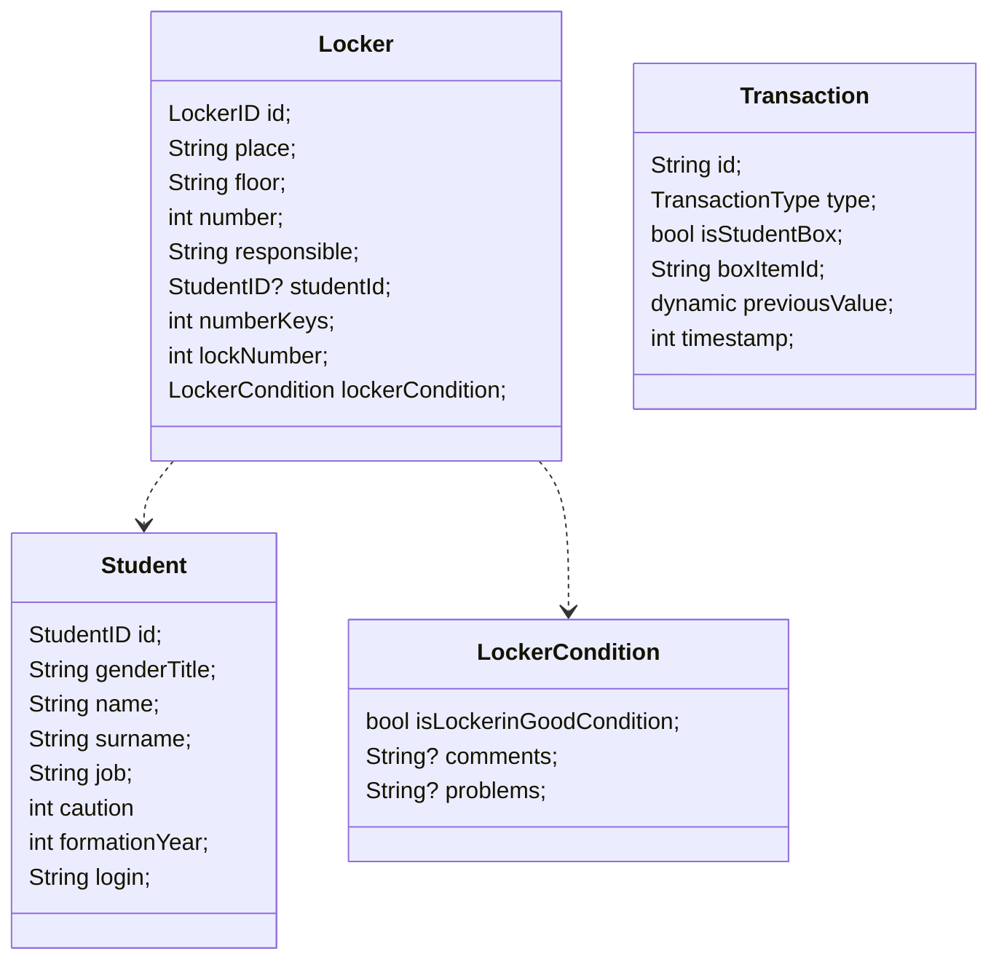

# Gestion casiers
Application desktop pour gérer les casiers.
Ce projet a été fait en collaboration avec Donzé pour la partie Front-End.

## Fonctionnalités
**L'actualisation des données n'est pas complètement dynamique.** Si vous avez fait une modification, mais que l'écran ne se met pas à jour, changer de page (dans l'application) et revenir dessus suffit.

### Dashboard
- [X] Affichage d'un résumé général
- [X] Affichage d'un résumé des casiers
- [X] Affichage d'un résumé des élèves
- [X] Affichage d'un résumé des clés
### Casiers
- [X] Affichage de la liste des casiers
- [X] Filtre des casiers
- [X] Recherche dans les casiers
- [X] Ajout d'un casier
- [X] Affichage des détails d'un casier
- [X] Modification d'un casier
- [X] Suppression d'un casier
- [X] Importer les casiers depuis un excel
### Élèves
- [X] Affichage de la liste des élèves
- [X] Filtre des élèves
- [X] Recherche dans les élèves
- [X] Ajout d'un élève
- [X] Modification d'un élève
- [X] Suppression d'un élève
- [X] Importer les élèves depuis un excel
### Liaisons
- [X] Affichage de la liste des casiers vides
- [X] Recherche dans les casiers vides
- [X] Affichage de la liste des élèves sans casiers
- [X] Recherche dans les élèves sans casiers
- [X] Sélection d'un élève et d'un casier
- [X] Liaison de la sélection
### Actions
- [X] Affichage de la liste des actions
- [X] Retour en arrière avec un clic sur l'élément choisi
- [X] Bouton de retour en arrière pour la dernière modification
- [X] Vidage des anciennes actions

# Développement

## Précisions
- Les données sont sauvegardées sur *Hive*, qui permet d'avoir un stockage permanent **local**.
- Certaines icônes de material (extension VSCode) ont étés modifiés depuis `.vscode/settings.json`

## Repositories
3 *repositories* différents ont été créé pour gérer les données de l'application. Chaque *repository* possède un *NotifierProvider* géré par *Riverpod* pour les affichages dynamiques.

- Lockers
- Students
- Transactions

Pour chaque *repository* une box de Hive est crée, accessible depuis l'extérieur avec un paramètre *static*.

## Excel
L'import des fichier *excel* est géré dans le fichier `src/utils/excel.dart`

- L'import des élèves vérifie le nom de la page et retourne une erreur en cas de mauvais nom
- L'import des casiers vérifie déjà les noms pour n'importer que les bons étages

## Classes

En cas de changement / création de la classe, les points suivants doivent être vérifiés :
1. La classe contient une ligne `part '<classe>.g.dart'`
2. La classe contient une ligne `@HiveType(typeId: <id>)` avant sa déclaration
3. Tous les paramètres possèdent une ligne `@HiveField(<numéro>)` avant eux

Une fois les points vérifiés, faites la commande `dart run build_runner build`.

### Note
Si les paramètres d'une classe ne sont plus avec les mêmes numéros, il faut vider la database du site puis refaire l'importation.