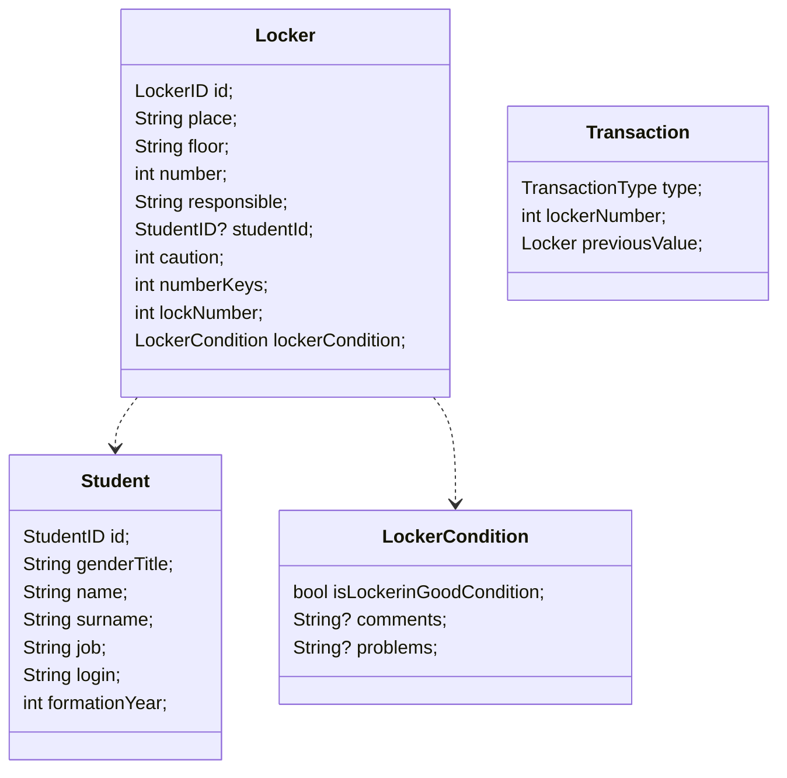

# Gestion casiers
Application desktop pour gérer les casiers.
Ce projet à été fait en collaboration avec Donzé pour la partie Front-End.

## Précisions
- Les données sont sauvegardés sur *Hive*, qui permet d'avoir un stockage permanent **local**.
- Certains icônes de material (extension) ont étés modifiés depuis `.vscode/settings.json`
- L'import depuis les fichiers excel ne fonctionne que sur les templates

# Développement

## Classes

En cas de changement / création de la classe, les points suivants doivent être vérifiés :
1. La classe contient une ligne `part '<classe>.g.dart'`.
2. La classe contient une ligne `@HiveType(typeId: <id>)` avant sa déclaration.
3. Tous les paramètres possèdent une ligne `@HiveField(<numéro>)` avant eux.

Une fois les points vérifiés, faites la commande `dart run build_runner build`.  
Note : Si les paramètres d'une classe ne sont plsu avec les même numéros, il faut vider le cache du site puis refaire l'importation.